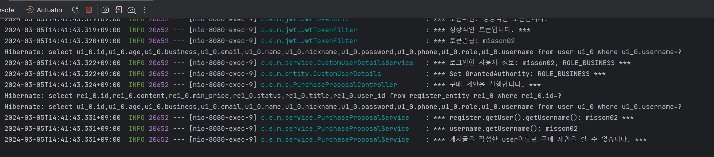

# Misson2_younsungbin

## 기본과제
1. 사용자 인증 및 권한 처리.
2. 중고거래 중개하기.
3. 쇼핑몰 운영하기.

### 사용 데이터베이스
Database - MySQL

### Test 방식
postMan 사용

### 완료 상태
추가과제 X
기본 과제 shop에서 동적쿼리를 만들지 못했음.

### 기본과제 - 사용자 인증 및 권한 처리.
1. 회원가입 시 권한 비활성 사용자(Inative)

2. 필요한 정보를 입력하면 일반사용자로 권한 변경.

3. 사업자 번호를 입력하면 사업자로 권한 변경
    * 관지가가 수락 또는 거절하는 것을 못보아서 구현을 못했다.


### 기본과제 - 중고거래 중개하기
1. 제목, 설명, 최소가격을 입력하여 중고 물품을 등록한다.

2. 구매 제안
    1. 물건의 주인은 물건에 거래 제안을 할 수 없다.
      
    
    2. 다른 사용자가 물건에 거래 제안을 한다.
    
    3. 구매 제안은 물품을 등록한 사용자와 제안을 등록한 사용자만 조회가 가능하다.
      
    
      
    
3. 물품을 등록한 사용자는 등록된 구매 제안을 수락 또는 거절할 수 있다.
- 수락
      
    
- 거절
    
4. 제안을 등록한 사용자는 자신이 등록한 제안이 수락 상태일 경우, 구매 확정을 할 수 있다.
- 하나의 판매 상품에 2개의 제안이 있다.
    
- 1개의 상품이 거래 제안이 수락 되었다.
    
- 거래 제안한 사용자가 구매 확정을 하였다.
      
- 구매 확정이 되었으면 같은 판매 상품에 거래 제안한 상품의 상태가 거절이 된다.
    

### 기본과제 - 쇼핑몰 운영하기
1. 일반 사용자가 사업자 사용자로 전환될 때 준비중 상태의 쇼핑몰이 추가된다.

2. 쇼핑몰의 이름, 소개, 분류가 전부 작성된 상태라면 쇼핑몰을 개설 신청할 수 있다.
  
  

3. 관리자는 개설 신청된 쇼핑몰의 목록을 확인할 수 있다.
- 관리자가 아니면
    
- 관리자면 확인 가능.
      
    
4. 관리자는 개설 신청된 쇼핑몰을 허가 또는 불허 할 수 있다.
- 허가
      
    
- 불허
      
      
      
    

# 프로젝트를 하면서 어려웠던 점
1. 데이터 베이스 테이블 설계.
2. .TransientPropertyValueException: Jpa 영속성이 제대로 설정되지 않으면 나오는 에러.
3. 데이터베이스 활용하기. 데이터베이스 쿼리를 만들어야 하는데 그걸 생각 못해서 엄청 돌고 돌아 만들었었다. 뭔가 이상해서 정신을 차리고 jpql을 떠올리며 jpql을 사용해서 문제를 해쳐 나갔다.
    
    - jpql을 제대로 사용하는 것을 생각하지 못했을 때 코드
        ```java
        // 물품을 등록한 사용자는 모든 제안이 확인가능하다. => sql을 사용 안 하면 이렇게 뻘짓을 하게 된다.ㅎ
            public List<String> selectProposal123 (String token, Long registerId) {
               // 물품을 등록한 사용자인지 확인.
                Boolean checkUser = userCheck(token, registerId);
        
                // 구매 제안한 사용자인지 확인.
                User username = user(token);
        
                // 물품을 등록한 사용자라면 모든 제안 조회 가능
                if (!checkUser) {
                    log.info("*** 물품을 등록한 사용자가 맞습니다. 구매 제안 전부를 확인합니다.***");
                    List<PurchaseProposalEntity> list = proposalRepository.findAll();
                    List<String> proposalUsername = new ArrayList<>();
                    proposalUsername.add("물품을 등록한 사용자 " + username.getUsername() + " 입니다. 거래 제안을 모두 조회합니다.\n");
        
                    for (PurchaseProposalEntity a : list) {
                        // 내 물품에 제안이 온 것만 조회.
                        if (a.getRegisterEntity().getUser().getUsername()
                                .equals(username.getUsername())) {
                                proposalUsername.add("*** 내가 올린 물품의 구매 제안만 조회 *** \n");
                                proposalUsername.add("proposal id: " + a.getId() + "\n");
                                proposalUsername.add("구매 제안 한 id: " + a.getUser().getId() + "\n");
                                proposalUsername.add("구매 제안 한 username: " + a.getUser().getUsername() + "\n");
                                proposalUsername.add(
                                        "\"" + a.getRegisterEntity().getTitle() + "\""
                                        + "은 " + a.getRegisterEntity().getUser().getUsername()
                                       +  "의 물품입니다." + "\n"
                            );
                                proposalUsername.add(
                                        a.getRegisterEntity().getUser().getUsername() + "님의 "
                                        + "\"" + a.getRegisterEntity().getTitle() + "\"" + "의 판매 물품은 "
                                        + a.getUser().getUsername() + "님이 " + "\"" + a.getProposal() + "\"" + " 하였습니다.\n"
                                );
                            }else log.info("*** {}는 {}가 올린 물품이 아니어서 조회를 하지 못합니다.", a.getRegisterEntity().getTitle(), username.getUsername());
                        }
                        return proposalUsername;
                    }
                    else{
                        log.info("*** 물품을 등록한 사용자가 아닙니다. 구매 제안을 확인할 수 없습니다. ***");
                        throw new ResponseStatusException(HttpStatus.NOT_FOUND);}
             ```
        - jpql을 사용한 코드(수정)
            ```java
            // 물품을 등록한 사용자는 등록된 구매 제안을 수락 또는 거절 할 수 있다.
            // 이때 구매 제안의 상태는 수락 또는 거절이 된다.
            public PurchaseProposalDto decisionProposal(String token, Long consumerId ,Long registerId, String decision) {
                User user = user(token); // 토큰 사용자가 존재하는 사용자인지 확인.
                Optional<User> findConsumer = userRepository.findById(consumerId);
                User consumer = findConsumer.orElseThrow(()-> new ResponseStatusException(HttpStatus.NOT_FOUND));

                RegisterEntity register = registerEntity(registerId); // 판매 물품이 있는지 확인.
                Boolean seller = userCheck(token, registerId);// 판매 물품의 사용자 인지 확인 false가 판매자이다.

                if (!seller) {
                    // 거래 제안을 수락한다.
                    // 거래 제안 엔티티의 이 메서드 파라미터인 레지스터아이디와 같은 것의 상태를 수라갛낟.
                    // 판매자는 자신의 물건에 거래제안을 한 이 사람의 거래제안을 수락할 수 있다.
                    // 자신의 거래제안에서 소비자가 거래제안한 물품이 있다면 확인한다.
                    Optional<PurchaseProposalEntity> proposalEntity
                            = proposalRepository.findEqualsConsumerRegister(
                            user.getUsername(),
                            consumer.getId(),
                            registerId
                    );

                    PurchaseProposalEntity entity =
                            proposalEntity.orElseThrow(()-> new ResponseStatusException(HttpStatus.NOT_FOUND));

                    // 거래제안을한 아이디라면 수락한다.

                    entity.setStatus(decision);

                    proposalRepository.save(entity);

                    String explanation = "구매를 " + decision + "한다.";
                    return PurchaseProposalDto.fromEntity(explanation, entity, user.getUsername(), register.getTitle());
                }
                else {
                    throw new ResponseStatusException(HttpStatus.NOT_FOUND);
                }
            }
            ```
